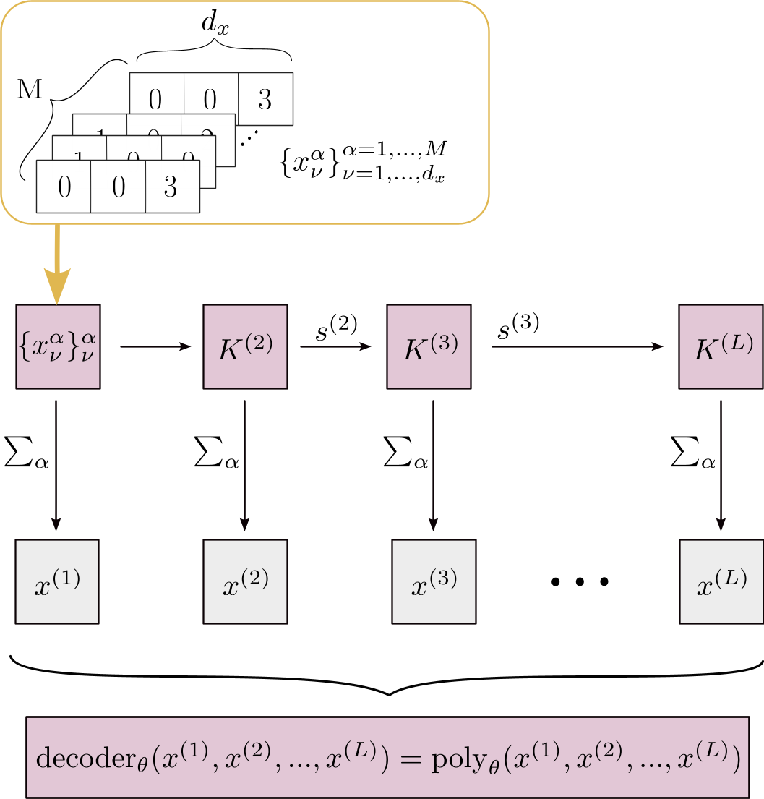

# Learning to detect optical nonclassicality
This repository provides tools for analyzing optical nonclassicality based on the Glauber–Sudarshan P representation, a quasiprobability distribution that describes the quantum state of light in terms of coherent states. Classical optical fields correspond to positive, well-behaved functions, while nonclassical states exhibit non-positive or singular functions, revealing genuinely quantum properties such as squeezing, antibunching, or entanglement.
The included Python code enables the setup and training of the algebraic classifier --- abbreviated with AlCla ---, a machine learning–based method developed to identify nonclassicality from data. The model is fully interpretable in the sense that the learned nonclassicality criterion can be extracted after training. Importantly, the criterion learned by the model may not be confused with a sufficient nonclassicality witness. Instead, the criterion is an indicator for whether a state in nonclassical or not.

The classifier has an encoder-decoder structure: The encoder learns to compute moments that are relevant for the classification whereas the decoder constructs a polynomial of these moments. As an alternative model, we replaced the algebraic decoder with a dense feed-forward neural network. The respective model is called Dense Decoder in the code.

{width=200px}
