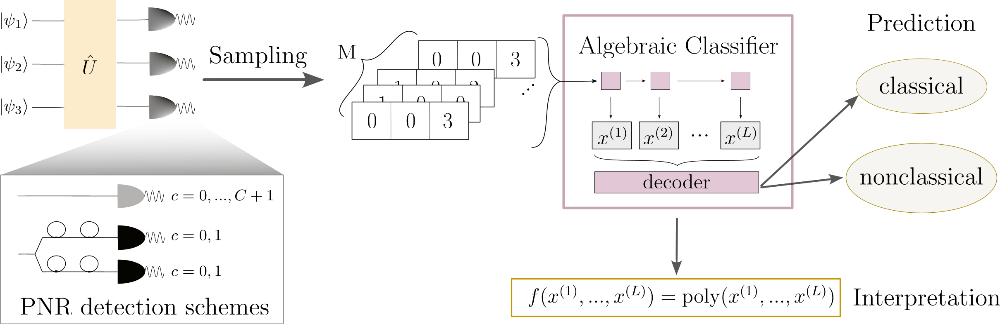

[](https://codecov.io/gh/MartinaJung/IdentifyingOpticalNonclassicality) [](https://doi.org/10.5281/zenodo.18647273)

# Learning to detect optical nonclassicality
This repository provides tools for analyzing optical nonclassicality based on the Glauber–Sudarshan P representation.

The code enables the setup and training of the algebraic classifier, a machine learning–based method developed to identify nonclassicality from data. Importantly, the learned nonclassicality criterion can be extracted after training. The analytical formula then represents an indicator for whether a state is nonclassical - not be confused with a sufficient nonclassicality witness.



---------------------------------------------------------------------------
## Installation

First, create an environment with
```
conda env create -f ml_nonclassicality.yaml 
```
Then, close the git repository with
